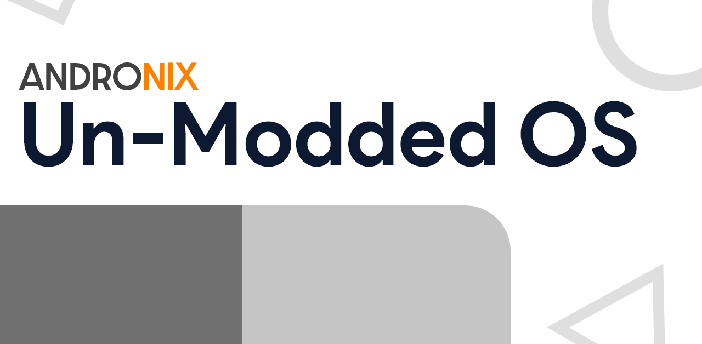

# Un-Modded OS

## What are un-modded OS?

As stated above in the sub-heading, un-modded OS are the free and [open-source](https://github.com/AndronixApp/AndronixOrigin) distro that Andronix offers. These are the distro packages without any desktop environment and contain only the bare-minimum things required to get it up and running.

## When Should you Choose these OS?

You should choose these un-modded OS when you need the ultimate control over what you want and what you don't. You can granularly install things or skip anything that you don't desire. As it doesn't come with a desktop environment out of the box, you have the choice to choose amongst the available ones.


We don't recommend these to complete beginners. You are expected to know at least the basic terminal commands. Here's what we mean-  [Basic Linux Terminal Commands](https://dev.to/kymiddleton/reference-guide-common-commands-for-terminal-6no)


## How to install it?

You can choose between 8 distributions that Andronix offers. 

These are the following things that need to be done before you're ready to use the distro-

* Install the distro with or without the desktop environment.
* Start the distro with ./_{distro}_.sh \(you can skip if you're installing it i.e. for the first time\).
* Start the VNC server and connect to it using a VNC-viewer.

Here's how you can install them















