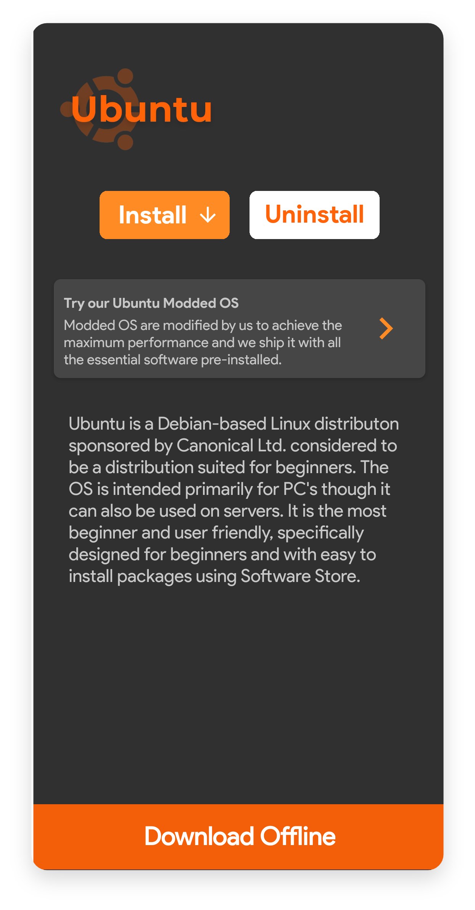
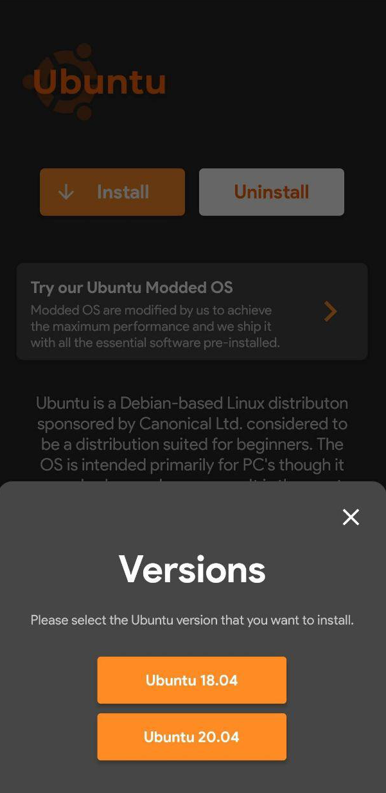
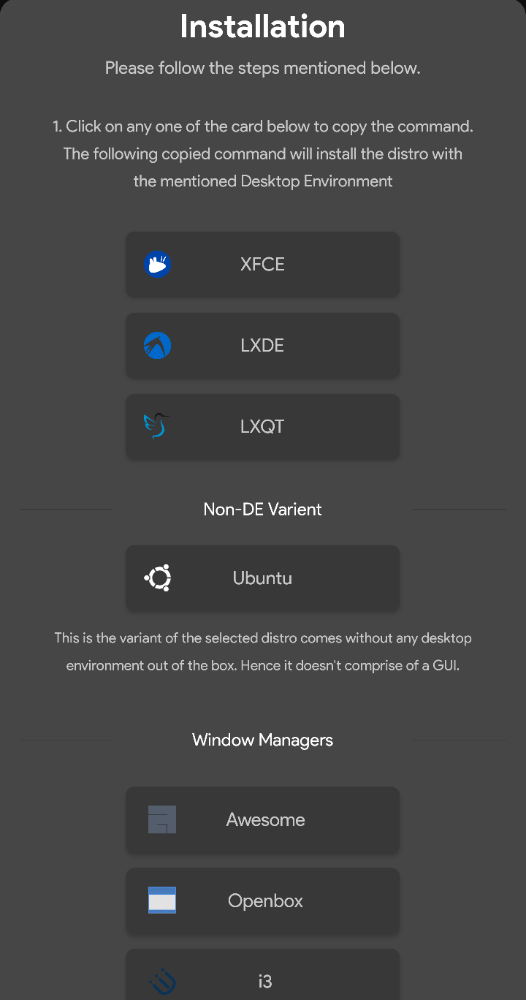
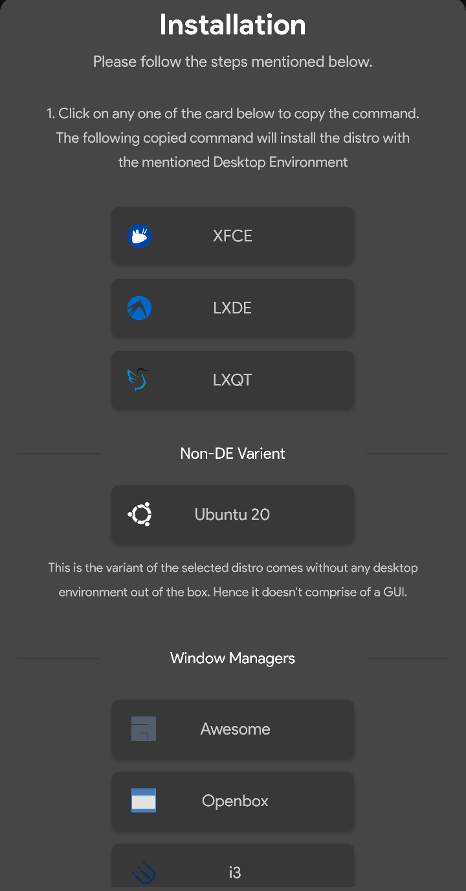

# Ubuntu


### Essential Information

Ubuntu provided by Andronix is open source including all the scripts needed for installing it. You can take a look at it [here](https://github.com/AndronixApp/AndronixOrigin).

**Download size** - 45 MB


above is not the size after installing Ubuntu but it's just the tar size that Andronix downloads. **This doesn't include a desktop environment for the GUI**.


## How to Install?

### Ubuntu 18

* Open the[ Andronix App](https://andronix.app/) and click on the Ubuntu card.
* Click the **Install** button.



* Select the version you want to install, namely 18.04



* The first three options will install Ubuntu with the mentioned [Desktop Environment](https://en.wikipedia.org/wiki/Desktop_environment). The **Non-DE** variant installs Ubuntu 18 without any Desktop Environment and is recommended for using the distro only with a _Command Line Interface_. The last three options will install Ubuntu with the mentioned [Windows manager](https://en.wikipedia.org/wiki/Window_manager).


We recommend to choose **XFCE variant** as it is the most stable, smooth, advanced and customizable Desktop Environment present at the moment




* Use the command below to update your termux packages so that you're running the updated versions of the required packages.

```text
pkg update
```


* Tap & hold anywhere on the screen and press **Paste**.
* Press **Enter** and wait till the installation completes.
* Type the following command to start the distro and press enter.

```text
./start-ubuntu.sh
```

* Now if you see `root@localhost` in Termux then you have successfully started Ubuntu.

### Ubuntu 20

* Open the[ Andronix App](https://andronix.app/) and click on the Ubuntu card.
* Click the **Install** button.


* Select the version you want to install, namely 20.04


* The first three options will install Ubuntu 20 with the mentioned [Desktop Environment](https://en.wikipedia.org/wiki/Desktop_environment). The **Non-DE** variant installs Ubuntu without any Desktop Environment and is recommended for using the distro only with a _Command Line Interface_. The last three options will install Ubuntu 20 with the mentioned [Windows manager](https://en.wikipedia.org/wiki/Window_manager).


We recommend to choose **XFCE variant** as it is the most stable, smooth, advanced and customizable Desktop Environment present at the moment




* Use the command below to update your termux packages so that you're running the updated versions of the required packages.

```text
pkg update
```


* Tap & hold anywhere on the screen and press **Paste**.
* Press **Enter** and wait till the installation completes.
* Type the following command to start the distro and press enter.

```text
./start-ubuntu20.sh
```

* Now if you see `root@localhost` in Termux then you have successfully started Ubuntu.

### Exiting VNC

Exiting and stopping the VNC server gracefully is important to avoid any ghost process to be running and rendering the server almost useless. Read about how to exit the VNC server in this article.



