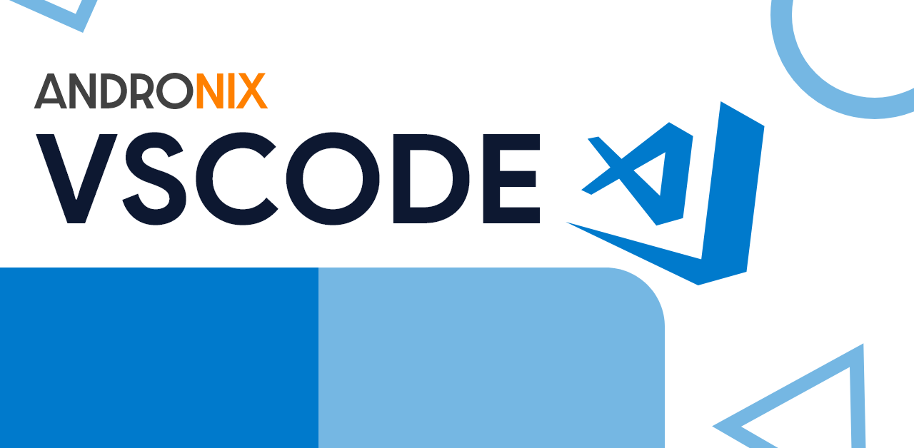

# VS Code



Andronix supports VS Code on all four of our support CPU architectures namely ARM64\(armv8\), armv7, i686 and x86\_64. 


**Modded OS** come installed with VS Code of out the box.


Debian based distros \(Package Manager - **apt**\)

```text
apt install wget -y && wget https://raw.githubusercontent.com/AndronixApp/AndronixOrigin/master/Uninstall/vscode_patch.sh && chmod +x vscode_patch.sh && ./vscode_patch.sh
```


